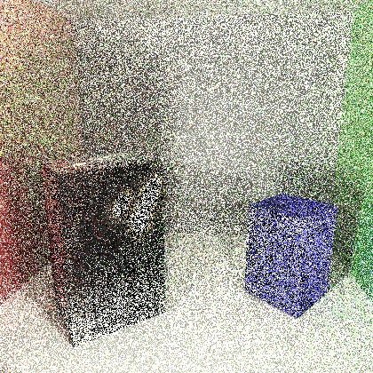
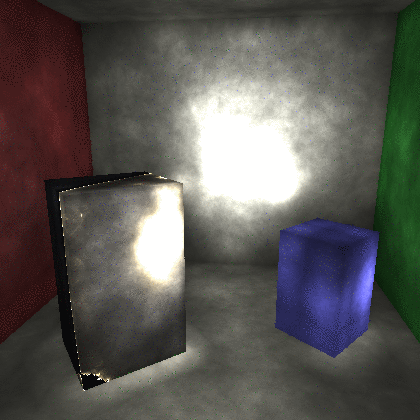
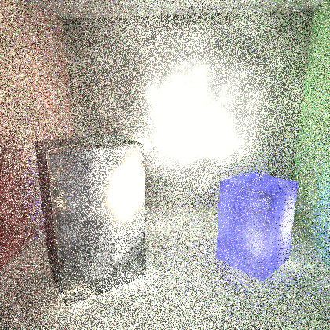

# Ray tracing engine
A C++ based renderer which utilizes ray tracing or path tracing to render a scene.  The renderer supports global illumination, reflections, soft shadows, and area lights. Rendering can be done either with or without construction of a photon map.


## Usage

### Compiling
```bash
$ git clone https://github.com/nikitakaraevv/ray-tracing-engine
$ cd ray-tracing-engine
$ mkdir build
$ cd build
$ cmake ..
$ make
```

### Running 
./RayTracer

## Examples
Ray Tracing                |   Path Tracing      
:-------------------------:|:-------------------------:
    |   

Ray tracing with Photon Mapping   |  Path tracing  with Photon Mapping  
:-------------------------:|:-------------------------:
 |  

