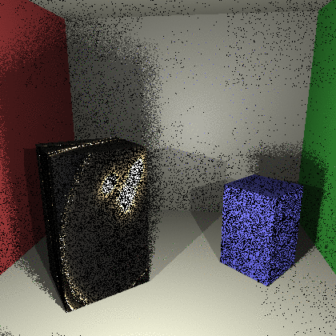

# Ray tracing engine
A C++ based renderer developed from scratch. It utilizes either ray tracing or path tracing to render a scene.  The renderer supports global illumination, [microfacet reflections](http://www.pbr-book.org/3ed-2018/Reflection_Models/Microfacet_Models.html), shadows, and area lights. Rendering can be done either with or without construction of a [photon map](https://en.wikipedia.org/wiki/Photon_mapping).
Most of the theory from the [Image Synthesis course](http://www.enseignement.polytechnique.fr/informatique/INF584/) and [Physically Based Rendering book](http://www.pbr-book.org)

## Examples
Ray Tracing                |   Path Tracing      
:-------------------------:|:-------------------------:
    |   

Ray tracing with Photon Mapping   |  Path tracing  with Photon Mapping  
:-------------------------:|:-------------------------:
 |  

## Usage

### Compiling
```bash
$ git clone https://github.com/nikitakaraevv/ray-tracing-engine
$ cd ray-tracing-engine
$ mkdir build
$ cd build
$ cmake ..
$ make
```

### Running
Rendering can be started by `./RayTracer` and a set of input arguments to customize the process. You can take a look at the list of available arguments by calling `./RayTracer -help`. Note that none of the parameters is mandatory for rendering since default values will be assigned to them at the beginning.

Here is a typical running command and some comments:

- `./RayTracer  -width 420 -height 420 -m 1 -N 128 -p 50000 -k 10`
  + The output image will be of size `420x420`.
  + `-m` defines mode of rendering. 0 is for ray tracing, 1 for path tracing. 
  + The number of traced rays through each pixel will be defined by `-N`.
  + If `-p` is used, renderer will create a photon map and use it to render the image. `-k` indicates number of nearest photons to be considered during rendering.
  + In addition the renderer saves intermediate results to `update.ppm`.
 

## Author
[Nikita Karaev](https://github.com/nikitakaraevv)
